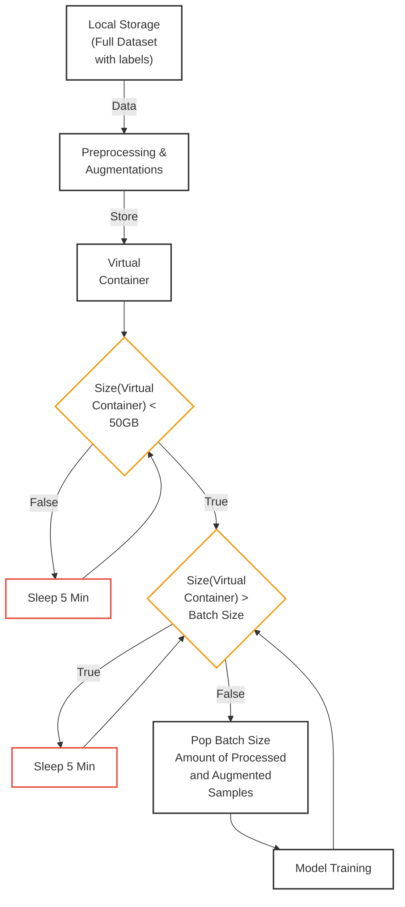

# Dynamic Training of Whisper ASR Model

This project implements a dynamic training approach for the Whisper ASR model, enabling efficient training on large-scale audio datasets (900 hours of audio, approximately 693k+ files) with on-the-fly augmentation.

## Problem Statement

Training a speech recognition model on vast audio datasets with augmentation presents significant memory challenges:
- OS memory out-of-bound errors occur when processing large portions of the dataset
- Conventional approaches fail when the combined size of the dataset and augmentations exceeds available memory
- On-the-fly augmentation during training creates computational bottlenecks

## What is Dynamic Training?

Dynamic training is a virtual container-based training procedure that solves these challenges by:
1. Processing and augmenting data in advance
2. Storing these augmented samples in a virtual container (Redis)
3. Managing memory constraints with container size checks
4. Feeding batches of processed data to the model during training
5. Continuing this cycle until the entire dataset is processed

## Process Flow



## Technical Implementation

### Key Components

1. **Redis Virtual Container**
   - Serves as intermediate storage for processed and augmented audio
   - Implements a queue data structure for efficient First-In-First-Out (FIFO) processing
   - Configurable memory limit (49GB)
   - Implements wait mechanisms to prevent memory overflow

2. **Audio Augmentation Pipeline**
   - Speed augmentation
   - Pitch shifting
   - Far-field effect simulation
   - Background noise addition
   - Color noise generation
   - Time and frequency masking (SpecAug)
   - Down/upsampling (old microphone effects)
   - Speech enhancement

3. **Data Flow Management**
   - Ensures virtual container size stays below 50GB
   - Checks for batch availability before training
   - Implements sleep intervals when memory constraints are hit

4. **Model Training**
   - Uses HuggingFace Transformers implementation
   - Customized data collator to fetch from Redis
   - Robust error handling throughout the pipeline

## Project Structure

```
├── audioaugmentations.py # Audio augmentation implementations
├── prepro_add2radis.py # Script to process and push data to Redis
├── final_training_medium.py # Whisper training with custom data collator
├── redis_manager.py # Redis operations and memory management
├── data_processor.py # Data preprocessing and feature extraction
├── training_manager.py # Model training and evaluation
├── config.py # Configuration using dataclasses
└── environment.yml # Conda environment specification
```

### Key Components

1. **Configuration Management** (`config.py`)
   - Centralized configuration using dataclasses
   - Separate configs for Redis, Model, and Audio Augmentation
   - Type-safe configuration parameters

2. **Redis Manager** (`redis_manager.py`)
   - Handles Redis operations
   - Memory management and monitoring
   - Data storage and retrieval
   - Error handling and logging

3. **Data Processor** (`data_processor.py`)
   - Audio data preprocessing
   - Feature extraction
   - Batch preparation
   - Error handling for data processing

4. **Training Manager** (`training_manager.py`)
   - Model initialization and configuration
   - Training setup and execution
   - Evaluation metrics computation
   - Checkpoint management

5. **Audio Augmentations** (`audioaugmentations.py`)
   - Speed augmentation
   - Pitch shifting
   - Far-field effect simulation
   - Background noise addition
   - Color noise addition
   - Time and frequency masking
   - Down/upsampling effects
   - Speech enhancement

## Features

- **Dynamic Training**: Virtual container-based training procedure
- **Memory Efficient**: Processes data in batches to prevent memory overflow
- **Real-time Augmentation**: Multiple audio augmentation techniques
- **Configurable**: Easy to modify parameters through config files
- **Error Handling**: Robust error handling throughout the pipeline
- **Type Safety**: Type hints and dataclasses for better code reliability

## Setup and Installation

### Requirements
- Python 3.8+
- PyTorch 2.0+
- Redis server
- CUDA-compatible GPU (recommended)

### Option 1: Using Conda (Recommended)
```bash
# Clone the repository
git clone [your-repo-url]
cd [your-repo-name]

# Create and activate conda environment
conda env create -f environment.yml
conda activate whisper-dynamic-training

# Configure Redis (if needed)
# Update config.py with your Redis settings
```

### Option 2: Using Pip
```bash
# Clone the repository
git clone [your-repo-url]
cd [your-repo-name]

# Create and activate virtual environment
python -m venv venv
source venv/bin/activate  # On Windows: venv\Scripts\activate

# Install dependencies
pip install -r requirements.txt
```

### Redis Setup
1. Install Redis Server:
   ```bash
   # Ubuntu/Debian
   sudo apt-get install redis-server

   # macOS
   brew install redis

   # Windows
   # Download from https://github.com/microsoftarchive/redis/releases
   ```

2. Start Redis Server:
   ```bash
   # Linux/macOS
   redis-server

   # Windows
   redis-server.exe
   ```

## Configuration

The system uses dataclasses for configuration:

```python
@dataclass
class RedisConfig:
    host: str = "localhost"
    port: int = 6380
    max_memory_gb: float = 49.0

@dataclass
class ModelConfig:
    # Model configuration parameters...

@dataclass
class AudioAugmentationConfig:
    # Audio augmentation parameters...

@dataclass
class Config:
    redis: RedisConfig = RedisConfig()
    model: ModelConfig = ModelConfig()
    audio_augmentation: AudioAugmentationConfig = AudioAugmentationConfig()
```

## Data Structure: Queue-Based Approach

The dynamic training system utilizes a queue data structure through Redis:

1. **FIFO Processing**
   - Audio samples are processed in the order they're added to the virtual container
   - Training batches are popped from the front of the queue
   - This ensures all samples are eventually processed in a predictable order

2. **Queue Management**
   - Redis provides efficient queue operations (push/pop)
   - Memory usage is monitored to prevent queue overflow
   - When the queue reaches capacity, the system waits until space is available

3. **Advantages of Queue-Based Design**
   - Constant-time enqueue and dequeue operations (O(1))
   - Prevents any single sample from being overprocessed
   - Natural fit for the producer-consumer pattern between preprocessing and training

## Advantages Over Traditional Approaches

Traditional approaches face these limitations:
- Loading all data into memory is impossible for large datasets
- Processing data on-the-fly during training is too slow
- Out-of-memory errors occur frequently when applying augmentations

Our dynamic training approach solves these issues by:
- Separating preprocessing from training
- Using Redis as an intermediate storage mechanism
- Managing memory constraints with a feedback loop
- Enabling rich augmentation without memory limitations

## Usage

1. **Preprocess and store data in Redis**:
   ```bash
   python prepro_add2radis.py
   ```

2. **Start training**:
   ```bash
   python final_training_medium.py
   ```

## Configuration

### Model Configuration
- Model name and language settings
- Training parameters (batch size, learning rate, etc.)
- Evaluation settings
- Checkpoint management

### Audio Augmentation Configuration
- Sample rate
- Augmentation probabilities
- Augmentation parameters
- Background noise settings

### Redis Configuration
- Host and port settings
- Memory limits
- Connection parameters

## Memory Management

The system implements several memory management strategies:
- Redis virtual container for data storage
- Batch-wise processing
- Memory monitoring and limits
- Automatic cleanup of processed data

## Error Handling

The system includes comprehensive error handling:
- Data processing errors
- Redis connection issues
- Memory overflow protection
- Training interruption handling

## Contributing

1. Fork the repository
2. Create a feature branch
3. Commit your changes
4. Push to the branch
5. Create a Pull Request

## License

[Your License]

## Acknowledgments

- OpenAI for the Whisper model
- Contributors to the audio augmentation libraries
